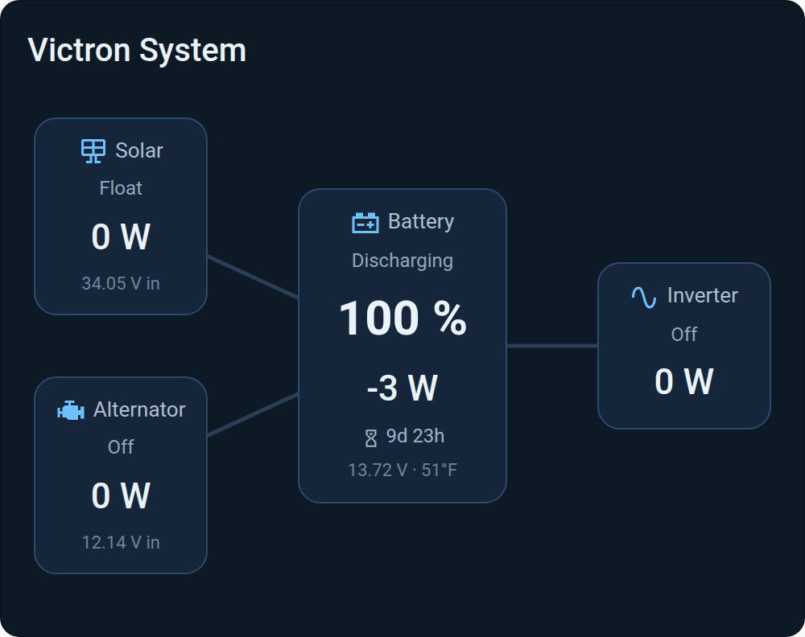
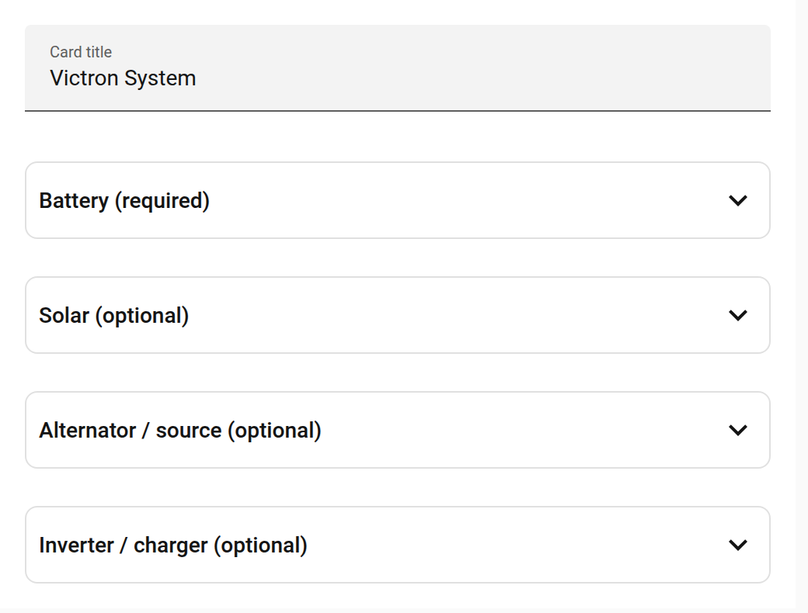

# Van Power Flow Card

[](https://github.com/leo-stan/hass-van-power-flow-card/releases)
[](https://hacs.xyz)
[](LICENSE)

A compact, **battery-centric** power-flow card for Home Assistant. A central
battery surrounded by up to three optional nodes — **solar**, **alternator**
(relabel for grid / generator / shore), and **inverter / charger** — with
animated flow lines, per-node state, and click-through history.

Built for DC systems (vans, RVs, boats, off-grid) where the stock Energy
Distribution card's grid/solar/home model doesn't fit. Pure vanilla JS, **no
build step**, themeable, with a visual editor.

<p align="center">
  
</p>

## Features

- 🔋 **Battery-centric layout** — battery in the middle; solar/alternator on the
  left, inverter on the right.
- ➕ **Everything optional** — only the battery is required. Omit any node and it
  (with its flow line) disappears; the layout re-centers automatically.
- 🌊 **Animated flow lines** — dots travel along active connections. The
  battery↔inverter line is **bidirectional** — it reverses based on the
  inverter's state (charging vs inverting).
- 📊 **Per-node detail** — state / charge stage, signed wattage, input voltage
  (solar PV / alternator source); the battery also shows SoC %, time-to-go,
  voltage, and temperature.
- 🕑 **Click for history** — tap any node to open Home Assistant's built-in
  History panel (last 24 h by default) pre-loaded with that node's entities, with
  the full timescale picker.
- 🎛️ **Visual editor** — configure it entirely in the HA card UI, no YAML
  required.
- 🎨 **Themeable** — all colors are `--vpf-*` CSS variables.

<p align="center">
  
</p>

## Installation

### HACS (recommended)

1. In HACS, go to **⋮ → Custom repositories**.
2. Add `https://github.com/leo-stan/hass-van-power-flow-card` with category
   **Lovelace / Dashboard**.
3. Install **Van Power Flow Card**, then hard-refresh your browser.

### Manual

1. Download `van-power-flow-card.js` from the
   [latest release](https://github.com/leo-stan/hass-van-power-flow-card/releases).
2. Copy it to `config/www/` on your HA instance.
3. Add a dashboard resource (**Settings → Dashboards → ⋮ → Resources → Add**):
   URL `/local/van-power-flow-card.js`, type **JavaScript Module**.
4. Hard-refresh your browser.

## Configuration

Add a card of type `custom:van-power-flow-card`. Use the **visual editor**, or
YAML. Only the `battery` section is required.

### Minimal

```yaml
type: custom:van-power-flow-card
title: My System
battery:
  soc: sensor.battery_soc
  power: sensor.battery_power   # signed: negative = discharging
```

### Full example

```yaml
type: custom:van-power-flow-card
title: Victron System
battery:
  name: Battery
  icon: mdi:car-battery
  soc: sensor.battery_charge             # %
  power: sensor.battery_power            # W, signed (− = discharging)
  voltage: sensor.battery_voltage        # V
  current: sensor.battery_current        # A
  temperature: sensor.battery_temp       # any unit
  time_to_go: sensor.battery_time_to_go  # seconds
  state: sensor.battery_state            # used only if `power` is unset
solar:
  name: Solar
  icon: mdi:solar-panel
  power: sensor.pv_power
  state: sensor.solar_charger_state      # e.g. bulk / absorption / float
  input_voltage: sensor.pv_voltage       # panel voltage, shown as "N V in"
alternator:                              # relabel freely (grid / generator / shore)
  name: Alternator
  icon: mdi:engine
  power: sensor.alternator_power
  state: sensor.dcdc_charger_state
  input_voltage: sensor.starter_battery_voltage
inverter:
  name: Inverter
  icon: mdi:sine-wave
  power: sensor.ac_loads_power           # AC load wattage
  state: sensor.inverter_state           # drives flow direction (see below)
  mode: select.inverter_mode             # optional tap target (more-info)
```

### Options

| Node | Key | Meaning |
|------|-----|---------|
| **battery** *(required)* | `soc` | State of charge (%) |
| | `power` | Power in W, **signed** (− = discharging). Drives the Charging/Discharging/Idle label. |
| | `voltage` / `current` / `temperature` | Shown in the battery's detail line |
| | `time_to_go` | Seconds; rendered like Victron VRM (floored, e.g. `9d 23h`) |
| | `state` | Fallback status label when `power` is not set |
| **solar / alternator** *(optional)* | `power` | Wattage (line is "active" when > 0) |
| | `state` | State / charge stage label |
| | `input_voltage` | Source voltage, shown as `N V in` |
| **inverter** *(optional)* | `power` | AC load wattage |
| | `state` | Charge/invert state — controls flow direction |
| | `mode` | Optional `select` / `switch` entity used as the tap target |

Every node also accepts `name` and `icon`.

### Flow direction

Sources (solar, alternator) flow **into** the battery whenever their power is
> 0. The inverter line is bidirectional, driven by its `state`:

- **Charging** (`bulk`, `absorption`, `float`, `charging`, …) → flows **into**
  the battery (AC → DC).
- **Inverting** (`inverting`, `power_assist`, `discharging`, …) or any positive
  AC load → flows **out** of the battery (DC → AC).

## Theming

Override any of these CSS variables (e.g. via `card_mod` or a theme):

```
--vpf-bg            --vpf-node-bg           --vpf-hdr
--vpf-fg            --vpf-node-border       --vpf-muted
--vpf-accent        --vpf-node-hover        --vpf-sub
--vpf-line-on       --vpf-node-bg-hover     --vpf-sub-dim
--vpf-line-off      --vpf-dot
```

## Notes

- Designed and tested against a Victron system (Cerbo GX, MultiPlus, BMV,
  BlueSolar MPPT, Orion DC-DC), but works with **any** entities — it's just
  power/voltage/state sensors.
- The card *type* is `custom:van-power-flow-card`.

## License

[MIT](LICENSE)
